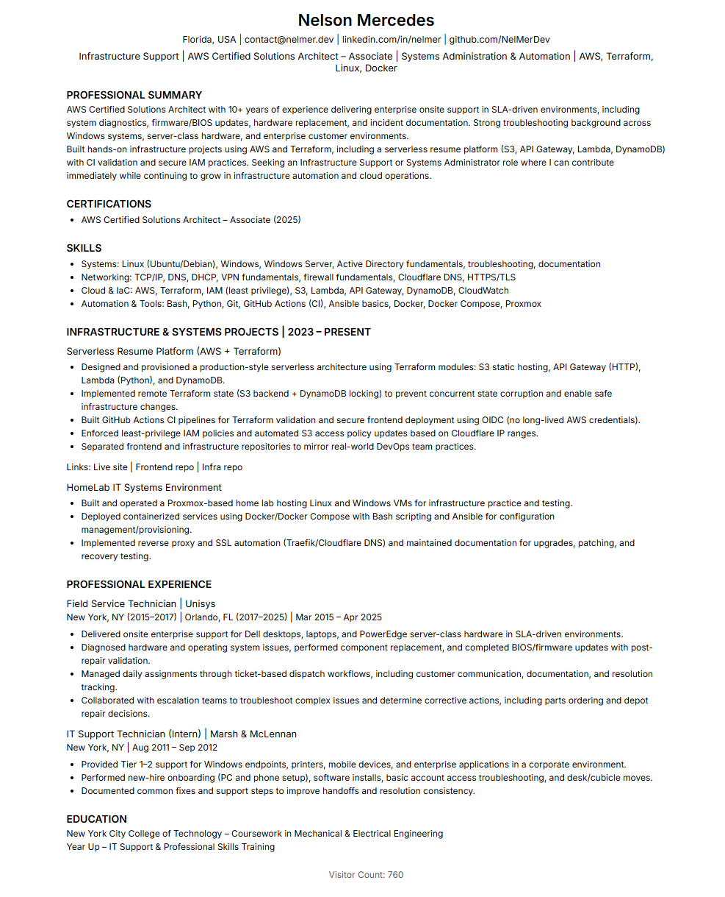

# 📄 Resume Website – Frontend



This repository contains the static frontend for my cloud-hosted resume website:

👉 https://resume.nelmer.dev

---

## 🚀 Architecture Overview

This project is part of my Cloud Resume Challenge implementation and demonstrates:

- Static website hosting on **Amazon S3**
- Infrastructure managed separately with **Terraform**
- Automated deployment using **GitHub Actions**
- Secure AWS authentication via **OIDC (no long-lived AWS keys)**

The infrastructure provisioning is available here:
👉 https://github.com/NelMerDev/resume.nelmer.dev-infra

---

## ⚙️ CI/CD Pipeline

On every push to `main`:

1. GitHub Actions assumes an AWS IAM role using OIDC
2. The workflow syncs the contents of `site/src/` to the S3 bucket
3. Files are updated using `aws s3 sync --delete`

This ensures fully automated, repeatable deployments.

---

## 📂 Project Structure

```
resume.nelmer.dev/
├─ site/src/ # Static website files
├─ .github/workflows/ # CI/CD pipeline
├─ README.md
├─ LICENSE
└─ .gitignore
```

---

## 🧠 What This Demonstrates

- Clean repo organization
- Infrastructure separation (frontend vs Terraform)
- Secure AWS deployment practices
- Production-style CI/CD workflow

---

Built and maintained by Nelson Mercedes.

